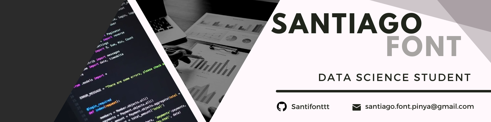

  

# Hello! 👋 I'm Santiago Font

### Data Science Student

---

## 💻 Skills & Technologies

    - **Languages:** Python, R, SQL and MATLAB
    - **Collaborative:** Git and Github

---

## 🌐 Let's Connect!

    - **Email:** santiago.font.pinya@gmial.com
    - **LinkedIn:** [Santiago Font](www.linkedin.com/in/santiago-font-piña-03b52b32a)

<!--
**santifonttt/santifonttt** is a ✨ _special_ ✨ repository because its `README.md` (this file) appears on your GitHub profile.

Here are some ideas to get you started:

- 🔭 I’m currently working on ...
- 🌱 I’m currently learning ...
- 👯 I’m looking to collaborate on ...
- 🤔 I’m looking for help with ...
- 💬 Ask me about ...
- 📫 How to reach me: ...
- 😄 Pronouns: ...
- ⚡ Fun fact: ...

-->
